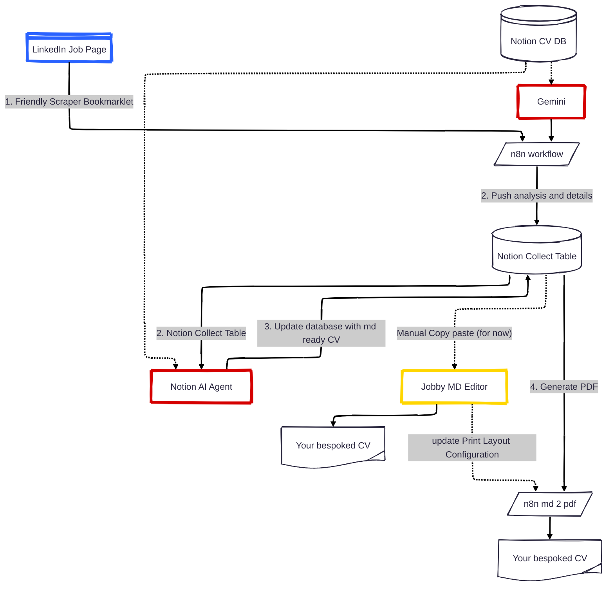

# Jobby Project Architecture & File Structure

This document details the system design, file structure, telemetry pipelines, and infrastructure architecture of the Jobby Project.

---

## 📁 Project File Structure

- `server.js`: Ultra‑lightweight local server written in Node.js. It serves the application, proxies API requests, and dynamically injects metadata.
- `public/index.html`, `public/style.css`: HTML structure and layout styles for the editor.
- `public/app.js`: Application entry point initializing ES modules.
- `public/js/`: Modular client-side JS subsystems:
  - `ats.js`: ATS scoring and resume analysis engine.
  - `bookmarklet.js`: Helper scripts to generate and compile LinkedIn scraper bookmarklets.
  - `config.js`: Configuration storage management, default styles, and sync states.
  - `developer.js`: Auth UX, inline credentials modal, and developer settings panel.
  - `exports.js`: Markdown, JSON import/export, and raw configuration copy handlers.
  - `highlight.js`, `syntax.js`: Synchronous syntax highlighting engine for the editor.
  - `parser.js`: Custom markdown-to-HTML parsing rules aligned with Gotenberg compiler.
  - `shortcuts.js`: Keyboard hotkeys and structural section swapping.
  - `styles.js`: Dynamic styling injector, cosmetics, and slider values handlers.
  - `tutorial.js`: Interactive animated popup tutorial demonstrating Markdown in 20 seconds, featuring path routing and dynamic theme/media styling.
  - `i18n.js`: Client-side internationalization engine that loads translation JSON files dynamically.
  - `tooltip.js`: Interactive markdown cheatsheet tooltip utility.
  - `theme.js`, `zoom.js`, `print.js`, `panning.js`, `utils.js`: Theme, zoom, scaling, panning, print previews, and core DOM utility helpers.
- `public/templates.css`: Rendering styles for A4 page (screen + PDF print rules).
- `public/sample.md`: Default resume template (example author) provided as a starting point.
- `public/resume.md`: **[Optional Backup]** A Markdown resume file placed on disk to bootstrap the editor if browser `localStorage` is empty.
- `public/config.json`: **[Optional Backup]** Custom layout configuration settings placed on disk to bootstrap the styles if browser `localStorage` is empty.

*Note: Placing `resume.md` and `config.json` in the `public` directory allows you to version-control and distribute default templates via Git.*

---

## ⚙️ System Architecture & Automated Workflows

Jobby is designed to be an automated, AI-assisted resume personalization pipeline that integrates your local or production editor, a scraper bookmarklet, n8n, and Notion.



### 1. Friendly LinkedIn Scraper
* **What it is:** A dynamic JavaScript bookmarklet that you drag into your browser bookmarks bar (generated under the **Developer** panel).
* **How it works:** When viewing a job description on LinkedIn, click the bookmarklet. It scrapes the job title, company, job URL, and the full job description text, and instantly POSTs it to your local or production n8n webhook.

### 2. Notion Databases & Late Fillup Template
To manage your application history and personalize your CV, the system is backed by two primary Notion databases:
* **Notion CV DB (Baseline):** Stores your baseline resume content in Markdown format, along with your default styling configurations (fonts, margins, spacing, and colors).
* **Notion Collect Table (Jobs):** Acts as your inbox. This table automatically collects and logs the job listings sent by the LinkedIn bookmarklet (including scraped descriptions and URLs).

### 3. Notion Agent to Configure (AI Matching)
* **What it is:** An n8n workflow coupled with an LLM (AI Agent) connected to your Notion workspace.
* **How it works:** 
  1. The agent triggers when a new job is added to the **Notion Collect Table**.
  2. It reads the job requirements and compares them against your baseline resume in the **Notion CV DB**.
  3. It automatically updates layout configurations (like adjusting margins to fit onto a single page, choosing professional font sizes, or tailoring accent words `:accent[...]` to match the job's keywords) and saves them back to the CV DB.

### 4. Button MD to PDF (Notion Action)
* **What it is:** A button integrated directly inside your Notion workspace pages.
* **How it works:** 
  1. Clicking this button in Notion triggers an n8n workflow.
  2. The workflow fetches the personalized Markdown content and the HTML/CSS layout configuration from your **Notion CV DB**.
  3. It passes this data to the **Gotenberg PDF rendering engine** running in the container.
  4. Gotenberg compiles the documents into a clean, A4-formatted, ATS-compliant PDF which is then saved back to Notion or prepared for your download.

---

## 📊 Telemetry & Data Pipeline

Jobby includes a lightweight telemetry pipeline to monitor editor performance, calculate layout rendering speeds, and track feature adoption.

- **Strict Anonymity**: Telemetry collection is strictly anonymous. No personal information, name, email, IP address, or resume text is ever collected or transmitted. A random session identifier is used solely to correlate editor actions.
- **Experimental Abstractions**: The backend currently proxies telemetry events to an n8n webhook and stores logs. Please note that **Notion** (acting as the metrics database) and **Axiom** (used for centralized logging) are current experimental integrations that are subject to change in future iterations.

### Event Capture & n8n Workflow
1. **Event Capture:** The frontend editor captures key user events (e.g., Session Start, Open/Save File, Copy Markdown, Print PDF, ATS Scorecard calculations, opening the About Modal, opening the Markdown Help Modal, and starting, completing, replaying, or exiting the popup tutorial).
2. **Secure Proxy:** Events are POSTed to the local `/api/telemetry` endpoint. This acts as a proxy, forwarding events to n8n without exposing credentials to the client.
3. **n8n Workflow:** A dedicated self-hosted n8n workflow (`n8n/jobby-telemetry.json`) is triggered via a webhook.
4. **Notion Database:** The n8n workflow logs the events into a central Notion Database (capturing metrics like session ID, event type, word/character count, ATS score, design preset, layout format, font family, browser, OS, initial ATS score, score delta, rule fixes count, preset switches history, active theme, history stack clicks, and compiler rendering times).

### Telemetry Configuration
To activate telemetry, ensure `N8N_TELEMETRY_WEBHOOK_URL` is set in your environment (managed securely via Doppler or in your `.env` file):
```env
N8N_TELEMETRY_WEBHOOK_URL="http://localhost:5678/webhook/jobby-telemetry"
```

---

## 💬 User Feedback Pipeline

Jobby includes a secure, interactive feedback collection system that allows users to submit suggestions, bug reports, and ratings directly from the editor header.

### How It Works
1. **Interactive Form:** Users click the **Feedback** button in Jobby's header actions to open a dialog form collecting name, email (optional), rating stars, feedback category (Comment, Improvement, Bug), and description text.
2. **Secure Proxy:** Submissions are POSTed to the local `/api/feedback` endpoint. This acts as a proxy, forwarding events to n8n without exposing credentials to the client.
3. **n8n Workflow:** A dedicated self-hosted n8n workflow (`n8n/jobby-feedback.json`) is triggered via a webhook.
4. **Notion Database:** The n8n workflow records the feedback details in a dedicated Notion Database called **Jobby Feedback**.

### Feedback Configuration
To activate the feedback pipeline, ensure `N8N_FEEDBACK_WEBHOOK_URL` is set in your environment:
```env
N8N_FEEDBACK_WEBHOOK_URL="http://localhost:5678/webhook/feedback"
```

---

## 🔍 SEO, Semantic HTML & Accessibility

Jobby is optimized for search engines, web crawler bots, and accessibility (WAI-ARIA):

- **Enhanced Meta Tags & Canonical URL:** The document head includes complete Open Graph (OG) and Twitter card metadata (including `og:locale` and `og:site_name`) to support social preview snippets. Canonical link tags prevent index dilution.
- **Rich Schema Structured Data:** A complete JSON-LD `SoftwareApplication` schema describes Jobby, its author, MIT licensing, and key capabilities to support Google Rich Snippets.
- **Noscript Fallback Content:** An elegant, styled fallback page is served inside a `<noscript>` tag, alerting users without JavaScript while explaining how to configure the editor.
- **Search-Engine-Crawlable Panel Placeholders:** To guarantee search engine crawlability even if JavaScript is not executed by bots, the container tags (`#header-container`, `#editor-container`, etc.) are pre-populated with detailed description templates in the raw HTML. These are seamlessly replaced by JavaScript on initialization.
- **Logical Heading Outline:** The application maintains a strict heading hierarchy starting with a single page `<h1>` and nesting panel sections under logical `<h2>` landmark headers.
- **WAI-ARIA & Screen Reader Support:** Interactive regions are labeled with appropriate roles and descriptions (e.g. `aria-label`, `.sr-only` screen-reader helper labels on inputs/sliders).
- **Testability IDs:** Interactive buttons, sliders, text inputs, and modals are assigned unique, descriptive `id` attributes to facilitate automated non-regression testing.

---

## 📑 Annex: Axiom Log Segregation & Configuration

To monitor errors and logs, the system integrates **Vector** as a container log shipper and **Axiom** as the log storage and analysis platform.

To ensure logs from different environments (production, test, development) are kept completely separate—even when running on the same physical Docker daemon/host—we enforce two layers of segregation:

### 1. HTTP Endpoint Segregation (Axiom Datasets)
Each environment should write to its own separate dataset in Axiom. This is configured via the `AXIOM_DATASET` variable in the environment file:
* **Production (`.env.prod`):**
  ```env
  AXIOM_DATASET="your-dataset-name"
  AXIOM_TOKEN="your-axiom-token"
  ```
* **Test/Staging:**
  ```env
  AXIOM_DATASET="your-dataset-name-test"
  AXIOM_TOKEN="your-axiom-token"
  ```

### 2. Docker Daemon Log Filtering (Vector Project Isolation)
Since Vector mounts `/var/run/docker.sock` to listen to all container stdout/stderr events on the host, a single Vector agent would normally capture and forward logs for every container on the host indiscriminately.

To prevent cross-environment log mixing on shared hosts:
1. All containers are associated with their respective Docker Compose project.
2. Vector’s configuration (`docker/vector.yaml`) contains a filter transform that matches the container’s Docker Compose project label against the current stack's name:
   ```yaml
   transforms:
     filter_project_logs:
       type: "filter"
       inputs:
         - "docker_logs"
       condition: '.label."com.docker.compose.project" == "${COMPOSE_PROJECT_NAME}"'
   ```
3. The `COMPOSE_PROJECT_NAME` is passed directly from `docker/docker-compose.yml` into the Vector container environment (defaulting to the production project name `n8n-eole-prod`).

This ensures that only logs produced by containers belonging to the local environment stack are forwarded to the configured Axiom dataset.
