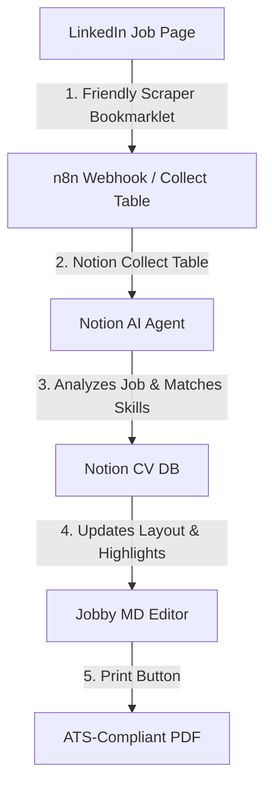

# jobby MD Editor

A premium, modern Markdown resume editor that respects ATS (Applicant Tracking System) standards, designed to run locally without heavy external dependencies.

It serves as a **quick and clean manual overdrive** for immediate layout tweaks and content changes, while also acting as the **HTML/CSS rendering configuration plane** for the PDF engine.

👉 **Production URL:** **[https://cv.eole.me](https://cv.eole.me)**

All your content and style changes (colors, fonts, margins) are automatically saved in your working folder, allowing you to resume work across machines via Git.

## 📋 Requirements

Before setting up Jobby, review the following platform and service requirements:

* **Host / Infrastructure:** 
  * Localhost: **Free** (for local development and testing).
  * Host VPS: **Cheap / Low cost** (required if you want a public, custom domain name).
* **n8n:** **Free** (self-hosted workflow automation platform running in Docker).
* **Traefik:** **Free** (secure HTTPS reverse proxy used for SSL certificate management).
* **Gotenberg (PDF Engine):** **Free** (handles PDF printing and compilation from HTML).
* **Gemini / Claude APIs:** **Free tier** available (but note that free tiers can be very rate-limited).
* **Notion:** **Free tier** available (but note that using an AI agent to generate Markdown inside Notion is currently very limited on the free tier).

## 📦 Installation & Setup

For step-by-step local running instructions (using either local Node.js or Docker WSL), please refer to the:
👉 **[Installation Guide (INSTALL.md)](file:///home/eole/projects/resume-md2html/INSTALL.md)**

---

## ⚙️ System Architecture & Automated Workflows

Jobby is designed to be an automated, AI-assisted resume personalization pipeline that integrates your editor, a scraper bookmarklet, n8n, and Notion.



### 1. Friendly LinkedIn Scraper
* **What it is:** A dynamic JavaScript bookmarklet that you drag into your browser bookmarks bar (generated under the **Developer** panel).
* **How it works:** When viewing a job description on LinkedIn, click the bookmarklet. It scrapes the job title, company, job URL, and the full job description text, and instantly POSTs it to your local or production n8n webhook.

### 2. Notion Databases & Late Fillup Template
To manage your application history and personalize your CV, the system is backed by two primary Notion databases:
* **Notion CV DB (Baseline):** Stores your baseline resume content in Markdown format, along with your default styling configurations (fonts, margins, spacing, and colors).
* **Notion Collect Table (Jobs):** Acts as your inbox. This table automatically collects and logs the job listings sent by the LinkedIn bookmarklet (including scraped descriptions and URLs).

### 3. Notion Agent to Configure (AI Matching)
* **What it is:** An n8n workflow coupled with an LLM (AI Agent) connected to your Notion workspace.
* **How it works:** 
  1. The agent triggers when a new job is added to the **Notion Collect Table**.
  2. It reads the job requirements and compares them against your baseline resume in the **Notion CV DB**.
  3. It automatically updates layout configurations (like adjusting margins to fit onto a single page, choosing professional font sizes, or tailoring accent words `:accent[...]` to match the job's keywords) and saves them back to the CV DB.

### 4. Button MD to PDF (Notion Action)
* **What it is:** A button integrated directly inside your Notion workspace pages.
* **How it works:** 
  1. Clicking this button in Notion triggers an n8n workflow.
  2. The workflow fetches the personalized Markdown content and the HTML/CSS layout configuration from your **Notion CV DB**.
  3. It passes this data to the **Gotenberg PDF rendering engine** running in the container.
  4. Gotenberg compiles the documents into a clean, A4-formatted, ATS-compliant PDF which is then saved back to Notion or prepared for your download.


## 📁 Project File Structure

- `server.js`: Ultra‑lightweight local server written in Node.js. It serves the application.
- `index.html`, `style.css`, `app.js`: Source code for the editing UI, auto‑zoom system, and ATS analyzer.
- `templates.css`: Rendering styles for A4 page (screen + PDF print rules).
- `sample.md`: Default resume template (example author) provided as a starting point.
- `resume.md`: **[Generated]** Your Markdown resume content.
- `config.json`: **[Generated]** Your custom layout settings (chosen fonts, sizes, line spacing, colors).

*Note: Committing and pushing `resume.md` and `config.json` to Git lets you synchronize all your text and style changes across machines.*

## 📝 Specific Resume Directives (Guide)

Following standard guidelines, you can use special shortcuts in your Markdown to style the output:

- **Accent Color**: Use `:accent[your text]` to color important elements (e.g., `:accent[Immediately available]`).
- **Muted Text (gray)**: Use `:muted[your text]` to visually de‑emphasize secondary information while keeping it indexable by ATS bots (e.g., `:muted[Driver's license B · Own vehicle]`).
- **Contact Bar**: The editor automatically detects the line containing your emails or links and formats it neatly. You can also force a centered contact block with the syntax `[CONTACT : email | phone | linkedin]`.
- **Two-Column Layout (Heading levels)**: When the **2-column layout** is enabled, section headers defined with `##` (H2) and `###` (H3) are styled identically but placed in separate columns:
  - `###` (H3) sections are placed in the **Sidebar Column (left)**.
  - `##` (H2) sections are placed in the **Main Column (right)**.
  *(Note: In 1-column layout, they are both displayed sequentially in a single column).*

## 🖨️ Generate PDF for Recruiters

When you are satisfied with your layout:

1. Click the **Print / PDF** button at the top right.
2. In your browser’s print dialog, select **Save as PDF** as the destination.
3. Check **Background graphics** to preserve colors, and uncheck **Headers and footers** for a clean page.
4. Save the file!

---

## 📑 Annex: Axiom Log Segregation & Configuration

To monitor errors and logs, the system integrates **Vector** as a container log shipper and **Axiom** as the log storage and analysis platform.

To ensure logs from different environments (production, test, development) are kept completely separate—even when running on the same physical Docker daemon/host—we enforce two layers of segregation:

### 1. HTTP Endpoint Segregation (Axiom Datasets)
Each environment should write to its own separate dataset in Axiom. This is configured via the `AXIOM_DATASET` variable in the environment file:
* **Production (`docker/.env`):**
  ```env
  AXIOM_DATASET="vps-eole-me"
  AXIOM_TOKEN="prod-token"
  ```
* **Test/Staging:**
  ```env
  AXIOM_DATASET="vps-eole-me-test"
  AXIOM_TOKEN="test-token"
  ```

### 2. Docker Daemon Log Filtering (Vector Project Isolation)
Since Vector mounts `/var/run/docker.sock` to listen to all container stdout/stderr events on the host, a single Vector agent would normally capture and forward logs for every container on the host indiscriminately.

To prevent cross-environment log mixing on shared hosts:
1. All containers are associated with their respective Docker Compose project.
2. Vector’s configuration ([vector.yaml](file:///home/eole/projects/resume-md2html/docker/vector.yaml)) contains a filter transform that matches the container’s Docker Compose project label against the current stack's name:
   ```yaml
   transforms:
     filter_project_logs:
       type: "filter"
       inputs:
         - "docker_logs"
       condition: '.label."com.docker.compose.project" == "${COMPOSE_PROJECT_NAME}"'
   ```
3. The `COMPOSE_PROJECT_NAME` is passed directly from [docker-compose.yml](file:///home/eole/projects/resume-md2html/docker/docker-compose.yml) into the Vector container environment (defaulting to the production project name `n8n-eole-prod`).

This ensures that only logs produced by containers belonging to the local environment stack are forwarded to the configured Axiom dataset.

