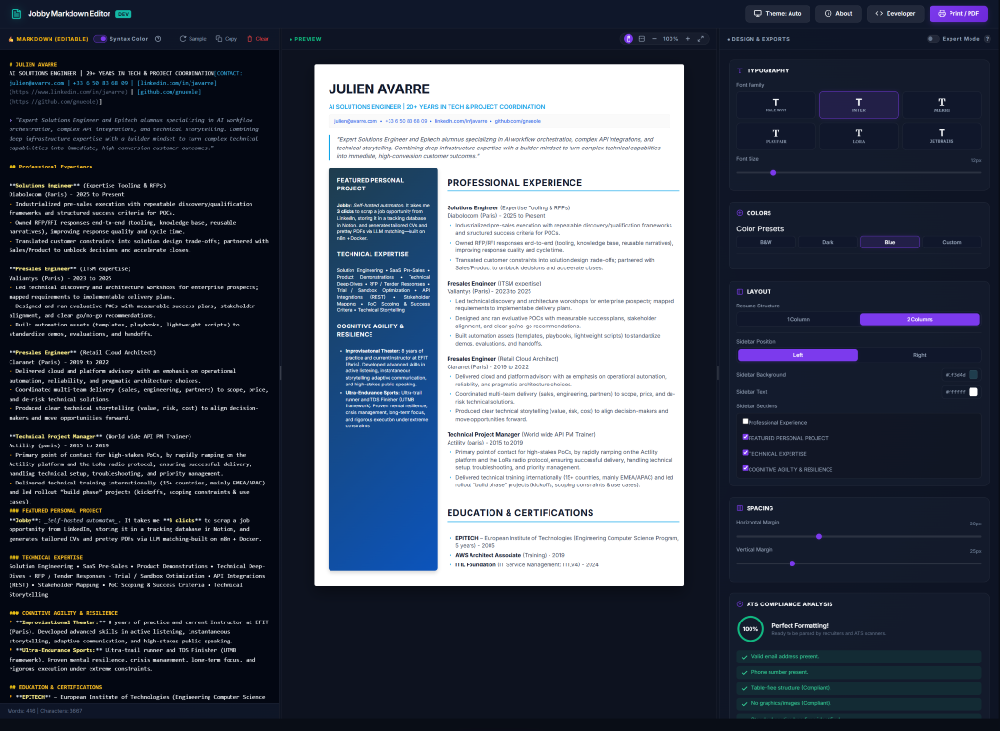
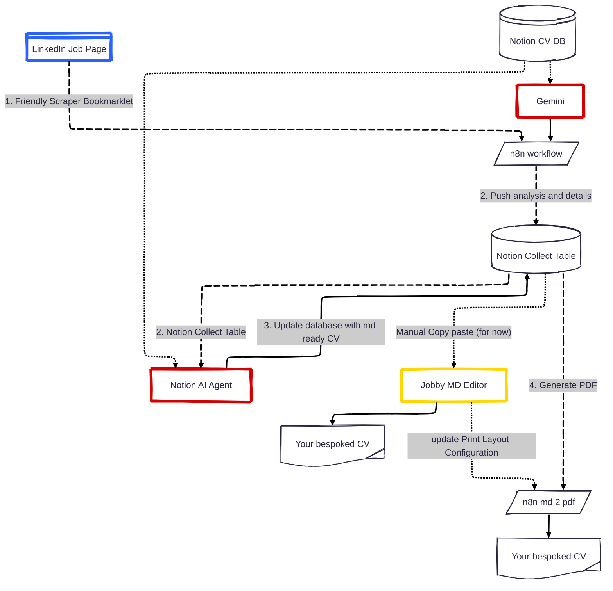
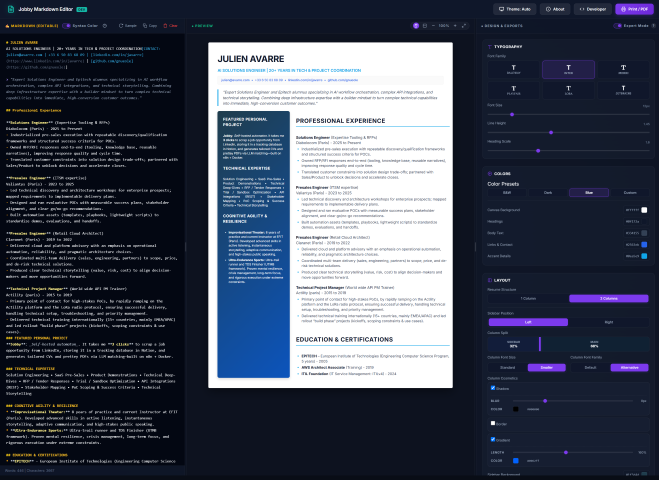
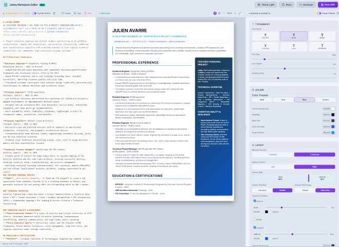
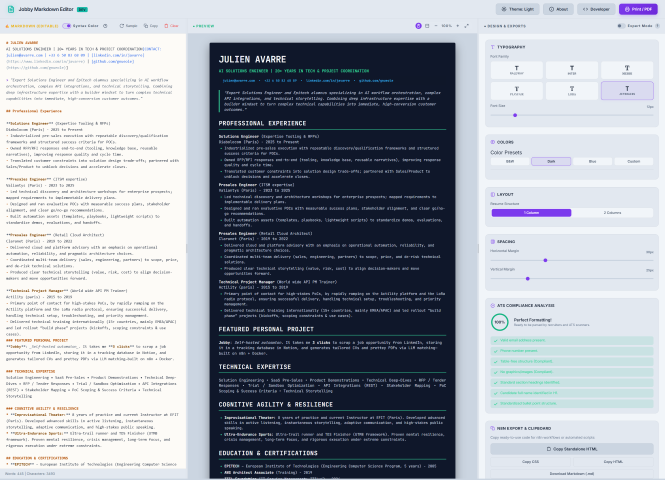

# jobby Project: An AI automated resume with a Markdown editor

*Author: Julien (Éole) Avarre (<hi@eole.me>) & Antigravity (Google DeepMind team)*
*Special thanks to **Maround Boutanos** for the shortcuts tooltip and design folding suggestions.*


> A premium, modern Markdown resume editor that respects ATS (Applicant Tracking System) standards, designed to run locally without heavy external dependencies.

It serves as a **quick and clean manual overdrive** for immediate layout tweaks and content changes, while also acting as the **HTML/CSS rendering configuration plane** for the PDF engine.

All your content and style changes (colors, fonts, margins) are safely stored in your browser's local storage (`localStorage`). You can copy your layout configurations or download your resume as Markdown from the UI.
<br /><br />

<p align="center">
  <a href="public/screenshots/screenshot01-simple.png">
    
  </a><br />
  👉 <strong>Production URL:</strong> <strong><a href="https://cv.eole.me">https://cv.eole.me</a></strong>
</p>


---

## 🖨️ Generate PDF for Recruiters

When you are satisfied with your layout:

1. Click the **Print / PDF** button at the top right.
2. In your browser’s print dialog, select **Save as PDF** as the destination.
3. Check **Background graphics** to preserve colors, and uncheck **Headers and footers** for a clean page.
4. Save the file!


## 🔍 Table of Contents

- [📋 Requirements](#-requirements)
- [🛠️ Tech Stack Choices](#️-tech-stack-choices)
- [📦 Installation & Setup](#-installation--setup)
- [🖨️ Generate PDF for Recruiters](#-generate-pdf-for-recruiters)
- [⚙️ System Architecture & Automated Workflows](#️-system-architecture--automated-workflows)
- [📊 Telemetry & Usage Analytics](#-telemetry--usage-analytics)
- [📁 Project File Structure](architecture.md)
- [📝 Specific Resume Directives (Guide)](#-specific-resume-directives-guide)
- [⚡ Interactive Editing & Layout Customizations](#-interactive-editing--layout-customizations)
- [📸 Screenshot Gallery](#-screenshot-gallery)
- [📑 Annex: Axiom Log Segregation & Configuration](#-annex-axiom-log-segregation--configuration)
- [✨ Wishlist & Future Improvements](#-wishlist--future-improvements)
- [🔗 Jobby Project Links](#-jobby-project-links)
- [📄 License](#-license)

---

## 🖨️ Generate PDF for Recruiters

When you are satisfied with your layout:

1. Click the **Print / PDF** button at the top right.
2. In your browser’s print dialog, select **Save as PDF** as the destination.
3. Check **Background graphics** to preserve colors, and uncheck **Headers and footers** for a clean page.
4. Save the file!


## 📋 Requirements

Before setting up Jobby, review the following platform and service requirements:

* **Host / Infrastructure:** 
  * Localhost: **Free** (for local development and testing).
  * Host VPS: **Cheap / Low cost** (required if you want a public, custom domain name).
* **n8n:** **Free** (self-hosted workflow automation platform running in Docker).
* **Traefik:** **Free** (secure HTTPS reverse proxy used for SSL certificate management).
* **Gotenberg (PDF Engine):** **Free** (handles PDF printing and compilation from HTML).
* **Gemini / Claude APIs:** **Free tier** available (but note that free tiers can be very rate-limited).
* **Notion:** **Free tier** available (but note that using an AI agent to generate Markdown inside Notion is currently very limited on the free tier).

## 🛠️ Tech Stack Choices

Jobby is built on a lightweight, modular, and self-hosted stack designed for maximum speed, easy deployment, and zero unnecessary dependencies:

### 1. Frontend: Pure & Fast
* **HTML5 & Vanilla ES6+**: The application relies on vanilla ES modules (`public/js/`) for core interactivity, keeping page loads instant and removing the need for a build step (webpack, vite, or babel).
* **Vanilla CSS**: Used for all interface styling and A4 canvas sheet emulation. It leverages CSS Custom Properties (CSS variables) to allow real-time layout customizer sliding values without heavy JavaScript state frameworks.
* **Marked.js**: A fast, client-side Markdown parser used to translate raw editor text into compliant HTML in real time.

### 2. Backend: Minimal Footprint
* **Node.js (Native HTTP)**: A pure Node.js HTTP server (`server.js`) with **zero external npm dependencies**. It starts in under 50ms, handles local routing securely, and exposes simple config endpoints.

### 3. PDF Printing Engine: Headless Chrome
* **Gotenberg**: A developer-friendly API that runs headless Chromium inside a Docker container. It renders the CSS print-stylesheet with pixel-perfect accuracy to generate recruitment-ready PDFs.

### 4. Integration & Automation
* **n8n**: A self-hosted workflow automation tool. It handles background webhook events, orchestrates the AI matching agent, reads/writes Notion database items, and triggers Gotenberg print outputs.
* **Notion API**: Used as a structured CMS to save baseline resumes, manage application history, and trigger layout compilations.

### 5. Infrastructure & Operations
* **Docker & Docker Compose**: Groups the editor, n8n, Gotenberg, Vector, and Postgres database into a clean, isolated multi-container architecture.
* **Traefik**: Acts as the reverse proxy, handling routing and automated SSL certificate generation via Let's Encrypt (ACME).
* **Vector & Axiom**: Vector monitors stdout/stderr of containers and forwards filtered logs to Axiom, separating local development logs from production logs.

## 📦 Installation & Setup

For step-by-step local running instructions (using either local Node.js or Docker WSL), please refer to the:
👉 **[Installation Guide](INSTALL.md)**


---

## ⚙️ System Architecture & Automated Workflows

Jobby is designed to be an automated, AI-assisted resume personalization pipeline that integrates your editor, a scraper bookmarklet, n8n, and Notion.



### 1. Friendly LinkedIn Scraper
* **What it is:** A dynamic JavaScript bookmarklet that you drag into your browser bookmarks bar (generated under the **Developer** panel).
* **How it works:** When viewing a job description on LinkedIn, click the bookmarklet. It scrapes the job title, company, job URL, and the full job description text, and instantly POSTs it to your local or production n8n webhook.

### 2. Notion Databases & Late Fillup Template
To manage your application history and personalize your CV, the system is backed by two primary Notion databases:
* **Notion CV DB (Baseline):** Stores your baseline resume content in Markdown format, along with your default styling configurations (fonts, margins, spacing, and colors).
* **Notion Collect Table (Jobs):** Acts as your inbox. This table automatically collects and logs the job listings sent by the LinkedIn bookmarklet (including scraped descriptions and URLs).

### 3. Notion Agent to Configure (AI Matching)
* **What it is:** An n8n workflow coupled with an LLM (AI Agent) connected to your Notion workspace.
* **How it works:** 
  1. The agent triggers when a new job is added to the **Notion Collect Table**.
  2. It reads the job requirements and compares them against your baseline resume in the **Notion CV DB**.
  3. It automatically updates layout configurations (like adjusting margins to fit onto a single page, choosing professional font sizes, or tailoring accent words `:accent[...]` to match the job's keywords) and saves them back to the CV DB.

### 4. Button MD to PDF (Notion Action)
* **What it is:** A button integrated directly inside your Notion workspace pages.
* **How it works:** 
  1. Clicking this button in Notion triggers an n8n workflow.
  2. The workflow fetches the personalized Markdown content and the HTML/CSS layout configuration from your **Notion CV DB**.
  3. It passes this data to the **Gotenberg PDF rendering engine** running in the container.
  4. Gotenberg compiles the documents into a clean, A4-formatted, ATS-compliant PDF which is then saved back to Notion or prepared for your download.

---

## 📊 Telemetry & Usage Analytics

Jobby includes a lightweight, secure telemetry pipeline to monitor editor usage and track candidate progress. 

### How It Works
1. **Event Capture:** The frontend editor captures key user events (e.g., Session Start, Open/Save File, Copy Markdown, Print PDF, and ATS Scorecard calculations).
2. **Secure Proxy:** Events are POSTed to the local `/api/telemetry` endpoint. This acts as a proxy, forwarding events to n8n without exposing credentials to the client.
3. **n8n Workflow:** A dedicated self-hosted n8n workflow (`n8n/jobby-telemetry.json`) is triggered via a webhook.
4. **Notion Database:** The n8n workflow logs the events into a central Notion Database (capturing metrics like session ID, event type, word/character count, ATS score, design preset, layout format, font family, browser, OS, initial ATS score, score delta, rule fixes count, preset switches history, active theme, history stack clicks, and compiler rendering times).

### Configuration
To activate telemetry, ensure `N8N_TELEMETRY_WEBHOOK_URL` is set in your environment (managed securely via Doppler or in your `.env` file):
```env
N8N_TELEMETRY_WEBHOOK_URL="http://localhost:5678/webhook/jobby-telemetry"
```

## 💬 User Feedback Pipeline

Jobby includes a secure, interactive feedback collection system that allows users to submit suggestions, bug reports, and ratings directly from the editor header.

### How It Works
1. **Interactive Form:** Users click the **Feedback** button in Jobby's header actions to open a premium dialog form collecting name, email (optional), rating stars, feedback category (Comment, Improvement, Bug), and description text.
2. **Secure Proxy:** Submissions are POSTed to the local `/api/feedback` endpoint. This acts as a proxy, forwarding events to n8n without exposing credentials to the client.
3. **n8n Workflow:** A dedicated self-hosted n8n workflow (`n8n/jobby-feedback.json`) is triggered via a webhook.
4. **Notion Database:** The n8n workflow records the feedback details in a dedicated Notion Database called **Jobby Feedback**.

### Configuration
To activate the feedback pipeline, ensure `N8N_FEEDBACK_WEBHOOK_URL` is set in your environment:
```env
N8N_FEEDBACK_WEBHOOK_URL="http://localhost:5678/webhook/jobby-feedback"
```


## 🔍 SEO, Semantic HTML & Accessibility

Jobby is designed to be highly indexable, accessible, and structured according to modern SEO best practices:

- **Enhanced Meta Tags & Canonical URL:** The document head includes complete Open Graph (OG) and Twitter card metadata (including `og:locale` and `og:site_name`) to support social preview snippets. Canonical link tags prevent index dilution.
- **Rich Schema Structured Data:** A complete JSON-LD `SoftwareApplication` schema describes Jobby, its author, MIT licensing, and key capabilities to support Google Rich Snippets.
- **Noscript Fallback Content:** An elegant, styled fallback page is served inside a `<noscript>` tag, alerting users without JavaScript while explaining how to configure the editor.
- **Search-Engine-Crawlable Panel Placeholders:** To guarantee search engine crawlability even if JavaScript is not executed by bots, the container tags (`#header-container`, `#editor-container`, etc.) are pre-populated with detailed description templates in the raw HTML. These are seamlessly replaced by JavaScript on initialization.
- **Logical Heading Outline:** The application maintains a strict heading hierarchy starting with a single page `<h1>` and nesting panel sections under logical `<h2>` landmark headers.
- **WAI-ARIA & Screen Reader Support:** Interactive regions are labeled with appropriate roles and descriptions (e.g. `aria-label`, `.sr-only` screen-reader helper labels on inputs/sliders).
- **Testability IDs:** Interactive buttons, sliders, text inputs, and modals are assigned unique, descriptive `id` attributes to facilitate automated non-regression testing.

---

## 📁 Project File Structure

For details on the project structure and frontend/backend files, please refer to:
👉 **[Project Architecture & File Structure](architecture.md)**

## 📝 Specific Resume Directives (Guide)

Following standard guidelines, you can use special shortcuts in your Markdown to style the output:

- **Accent Color**: Use `:accent[your text]` to color important elements (e.g., `:accent[Immediately available]`).
- **Muted Text (gray)**: Use `:muted[your text]` to visually de‑emphasize secondary information while keeping it indexable by ATS bots (e.g., `:muted[Driver's license B · Own vehicle]`).
- **Contact Bar**: The editor automatically detects the line containing your emails or links and formats it neatly. You can also force a centered contact block with the syntax `[CONTACT : email | phone | linkedin]`.
- **Two-Column Layout (Heading levels)**: When the **2-column layout** is enabled, section headers defined with `##` (H2) and `###` (H3) are styled identically but placed in separate columns:
  - `###` (H3) sections are placed in the **Sidebar Column (left)**.
  - `##` (H2) sections are placed in the **Main Column (right)**.
  *(Note: In 1-column layout, they are both displayed sequentially in a single column).*

---

## ⚡ Interactive Editing & Layout Customizations

The editor contains several premium UX enhancements to make document composition and layout adjustment seamless:

### 1. Keyboard Edition Shortcuts
Speed up your writing in the Markdown editor with the following shortcuts:
* **`Ctrl + B`**: Toggle **Bold** (adds/wraps selection in `**`).
* **`Ctrl + I`**: Toggle *Italic* (adds/wraps selection in `*`).
* **`Ctrl + K`**: Insert **Link** or transform selection to Link `[text](url)` (prompts for URL).
* **`Ctrl + 1` / `2` / `3`**: Set Heading level (`#`, `##`, or `###`) for the current line.
* **`Ctrl + UpArrow` / `DownArrow`**: 
  * If editing standard text: moves the current line above/below.
  * If inside/selecting a section (defined by a heading): moves the **entire section** (heading and text body) above/below the neighboring sections, maintaining complete structure.

### 2. Live Syntax Highlighting & Toggle
* The Markdown editor features a dynamic color highlighting system (customized for both Dark and Light UI modes) that color-codes headers, lists, links, and bold text as you type.
* To deactivate highlighting, simply uncheck the **Syntax Color** toggle in the editor's header to fallback to clean plain-text editing.

### 3. Layout Control Buttons
* Dropdown menus for **Resume Structure** and **Sidebar Position** have been replaced with modern, tactile active-toggle buttons.
* **Customizer Repositioning:** You can switch the customizer controls panel to the **Left Side** of your screen instead of the default **Right Side** to suit your preferred workflow.

### 4. Cosmetic Column Options (Expert Settings)
You can configure the appearance of your sidebar column in 2-column mode inside a set of beautifully aligned, card-styled collapsible groups:
* **Column Shadow:** Toggle a soft drop shadow (with customizable blur distance and shadow color picker, mixed with CSS `color-mix` for a professional soft ambient effect).
* **Column Border:** Toggle a border around the sidebar (with custom width in px and opacity/transparency percentage range sliders).
* **Column Gradient:** Toggle a background gradient starting from the sidebar base color and fading into a custom secondary color (with adjustable gradient length percentage).

### 5. Perfect Column Alignment
* Fixed vertical alignment between columns in 2-column mode by forcing both panels to occupy the same CSS Grid row (`grid-row: 1`). This prevents grid auto-placement from stacking columns vertically (e.g. when sidebar is toggled left).

### 6. Decoupled, Debounced Parser for Performance
* The Markdown editor syntax highlighter updates synchronously on typing for instant visual highlighting.
* The heavier HTML rendering engine, page-break layout engine, and saving operations are debounced by 200ms to keep the editing experience buttery-smooth even for long resumes.

### 8. System File Editor Integration (Open, Save, Save As)
* Integrated the browser's native **File System Access API** directly into the editor actions toolbar, treating Jobby like a standard desktop text editor (highly intuitive for non-power users).
* Clicking **Save** (or pressing `Ctrl+S`) saves the resume changes directly back to the open file on your system disk. If no file is open, it automatically triggers **Save As...**.
* Clicking **Save As...** (or pressing `Ctrl+Shift+S`) opens a system file picker dialog to choose a file name and path on your computer.
* Clicking **Open** (or pressing `Ctrl+O`) from the save dropdown menu opens a standard system file picker to choose and load any markdown (`.md` / `.txt`) file from your hard drive directly into the editor.
* Features automatic graceful degradation to standard HTML file upload `<input type="file">` and virtual download link `<a>` operations in browsers that do not support the File System Access API.

### 9. All Preset Buttons Renameable
* Every color preset button (B&W, Dark, Corporate Blue, Soft Blue, Soft Green, Soft Red, Custom, and Funky) can be renamed in place by double-clicking it. Custom names are persisted in local storage.

### 10. Import/Export Style Config JSON
* In the Developer Tools modal, developers can now export their custom style configuration as a JSON file and import it back to instantly apply layout settings.

### 11. Enhanced Print Margins & Page Size Sync
* Rebuilt print layout margin management to set browser `@page { margin: 0; }` and dynamically translate margins into `.a4-sheet` paddings. This avoids white margin borders on color themes/sidebars.
* Synchronized `@page` size to Letter or A4 based on the preview's format choice.

### 12. Design Panel Hiding
* Collapse the right customizer panel with a close button (cross SVG) next to the Expert Mode switcher to give the preview canvas maximum horizontal space.
* Reveal the design customizer at any time via a glassmorphic floating **Design** button in the lower-right corner of the canvas. Collapsed state is automatically persisted in the browser's local storage.

### 13. Markdown Editor Formatting Toolbar
* Toggle a rich-text formatting helper toolbar row directly above the writing canvas with a new **Format** button in the panel header.
* Instant formatting shortcuts for headings (H1, H2, H3), typography (Bold, Italic, Link), lists, custom markers (Accent, Muted), and section sorting controls (Move Up, Move Down) are all mapped seamlessly to keep typing fluid.
* Tooltips and a Markdown Cheatsheet dropdown list available on hover to guide new users.

### 14. Custom History Stack (Undo/Redo)
* A robust in-memory custom undo/redo history state stack (up to 100 entries) with dedicated UI toolbar control buttons and hotkeys (`Ctrl+Z`, `Ctrl+Y`) that track selection ranges and cursor coordinates perfectly.

### 15. Translucent Frosted Glass Dock (Glassmorphism)
* Styled the vertical folded controls dock with a modern glassmorphic frosted-glass background in both light and dark themes using CSS `backdrop-filter`. The circular buttons inside the dock adapt dynamically, becoming translucent in the light theme for better visual integration.

### 16. Modern Alert-Free Overwrites with Pre-emptive Undo Support
* Removed all native browser blocking `confirm()` popup alerts when loading the Julien Avarre sample, Jobby Updates ("What's New"), clearing the editor, or restoring drafts.
* To guarantee data safety, the editor automatically pushes your current text to the history stack *before* applying any changes, allowing you to instantly undo any overwrite via `Ctrl+Z` or the Undo toolbar button.

### 17. Dynamic Web App Manifest Integration
* Created a standard `manifest.json` under the public directory. The server (`server.js`) intercepts `/manifest.json` requests at runtime and dynamically injects the application version from `package.json`, ensuring `package.json` remains the single source of truth for the entire app.


## 📸 Screenshot Gallery

Here are some screenshots demonstrating Jobby's premium user interface in various configuration modes:

| Advanced Customizer Panel | Column Accent Alignments & Light Mode | Dark Canvas Mode & PDF Setup |
| :---: | :---: | :---: |
| <a href="public/screenshots/screenshot02-advancedmode.png"></a> | <a href="public/screenshots/screenshot03-lightmode-colright.png"></a> | <a href="public/screenshots/screenshot-04-lightmode-darkpage.png"></a> |
| *Expert customizations, visual grid splitting, and cosmetic card dropdowns.* | *Alternate column backgrounds, margins/padding rules, and cream colors.* | *Dual-tone high-contrast layouts tailored for recruiters and dark-theme lovers.* |

---

## 📑 Annex: Axiom Log Segregation & Configuration

To monitor errors and logs, the system integrates **Vector** as a container log shipper and **Axiom** as the log storage and analysis platform.

To ensure logs from different environments (production, test, development) are kept completely separate—even when running on the same physical Docker daemon/host—we enforce two layers of segregation:

### 1. HTTP Endpoint Segregation (Axiom Datasets)
Each environment should write to its own separate dataset in Axiom. This is configured via the `AXIOM_DATASET` variable in the environment file:
* **Production (`.env.prod`):**
  ```env
  AXIOM_DATASET="your-dataset-name"
  AXIOM_TOKEN="your-axiom-token"
  ```
* **Test/Staging:**
  ```env
  AXIOM_DATASET="your-dataset-name-test"
  AXIOM_TOKEN="your-axiom-token"
  ```

### 2. Docker Daemon Log Filtering (Vector Project Isolation)
Since Vector mounts `/var/run/docker.sock` to listen to all container stdout/stderr events on the host, a single Vector agent would normally capture and forward logs for every container on the host indiscriminately.

To prevent cross-environment log mixing on shared hosts:
1. All containers are associated with their respective Docker Compose project.
2. Vector’s configuration ([vector.yaml](docker/vector.yaml)) contains a filter transform that matches the container’s Docker Compose project label against the current stack's name:
   ```yaml
   transforms:
     filter_project_logs:
       type: "filter"
       inputs:
         - "docker_logs"
       condition: '.label."com.docker.compose.project" == "${COMPOSE_PROJECT_NAME}"'
   ```
3. The `COMPOSE_PROJECT_NAME` is passed directly from [docker-compose.yml](docker/docker-compose.yml) into the Vector container environment (defaulting to the production project name `n8n-eole-prod`).

This ensures that only logs produced by containers belonging to the local environment stack are forwarded to the configured Axiom dataset.

---

## 🔗 Jobby Project Links
* **[Installation Guide](INSTALL.md)** - Learn how to set up Jobby locally or via Docker.
* **[Changelog](CHANGELOG.md)** - Review releases and change history.
* **[Security Policy](SECURITY.md)** - View our security policy and vulnerability reporting instructions.

## ✨ Wishlist & Future Improvements

Here is a list of features and enhancements planned for future versions of Jobby, ordered by implementation complexity (e.g., quick wins first, complex integrations last):

- [x] **Add "Help" button in the UI:** Add a "Help" button in the interface that opens the Installation Guide and links back to the GitHub repository.
- [x] **Locale Multi-language support (i18n):** Implement a language switcher supporting English, French, Czech, Spanish, Italian, German, and Romanian, loading translation files dynamically.
- [ ] **Improve SEO:** Optimize meta tags, OpenGraph headers, and robot directives for public-facing resume pages.
- [ ] **Add GitHub Actions:** Automate syntax checking and dependency building for local developers.
- [ ] **Implement a download PDF button:** Download the PDF file directly via the running Gotenberg container instead of opening the browser's manual print dialog.
- [ ] **Automated PDF Sync to Drive:** Append an n8n node to save generated PDF resumes to Google Drive or Dropbox on build automatically.
- [x] **Feedback Button:** Introduce a feedback button opening an inline questionnaire feeding into a Notion database.
- [ ] **Gemini Credits:** Allow users to use their own Gemini/Claude API keys for AI resume personalization.
- [ ] **Multi-Profile Support:** Switch between multiple resume profiles (e.g., Developer, Product Manager) stored in `localStorage`/Notion.
- [ ] **PDF Compression:** Integrate a ghostscript/pdfsizeopt wrapper within the PDF docker compiler to keep ATS files under 500KB.
- [x] **Telemetry:** Collect anonymous stats on chosen resume layout presets and font pairings.
- [ ] **Cover Letter Generator:** Build a companion editor interface generating matching cover letters using identical color systems and spacing.
- [ ] **Interactive ATS Scanning:** Paste job descriptions inside the UI to calculate real-time keyword matching scores and improvements.
- [ ] **Google Account Sync:** Secure user authentication allowing resume backup/restore directly from Google Drive API storage.


## 📄 License
This project is open-source and available under the [MIT License](LICENSE).


